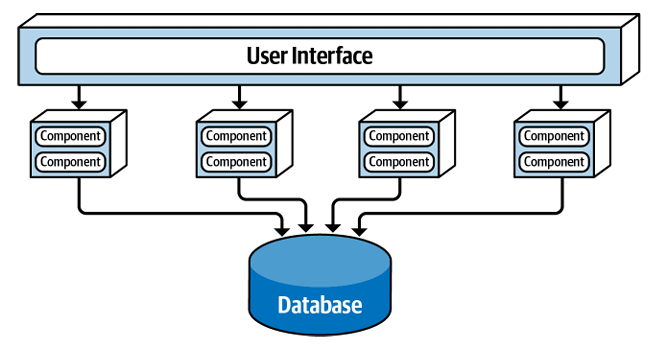
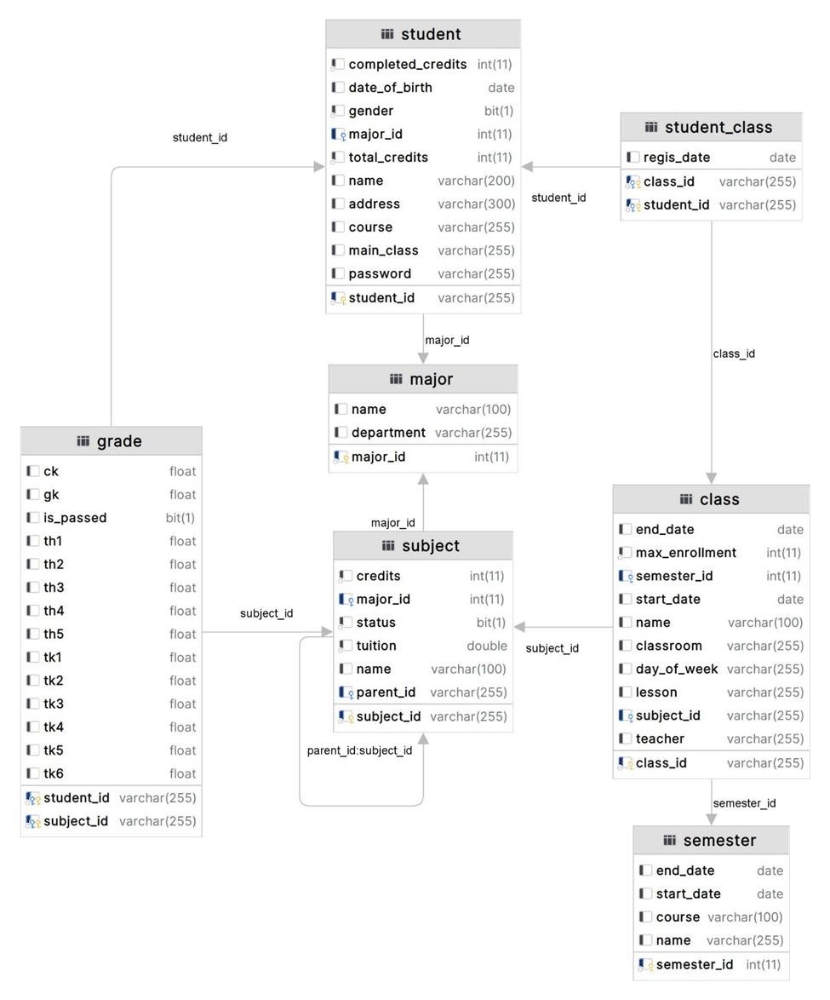

# Phân tích yêu cầu
Hệ thống quản lý sinh viên gồm:
1. Đăng ký học phần:
    - Sinh viên được biên chế theo khoa và ngành học.
    - Nhà trường sẽ mở các lớp học phần cho từng ngành.
    - Mỗi lớp học phần có số lượng sinh viên tối đa được quy định.
    - Sinh viên có thể đăng ký vào lớp học phần, với điều kiện không vượt quá 30 tín chỉ tối đa cho mỗi học kỳ.
    - Hệ thống sẽ kiểm tra điều kiện tiên quyết trước khi cho phép sinh viên đăng ký.
    - Sau khi đăng ký thành công, hệ thống sẽ gửi email xác nhận và thông báo đóng học phí.

2. Quản lý thông tin sinh viên:
    - Hệ thống lưu trữ thông tin cá nhân của sinh viên, bao gồm khoa, ngành học.
    - Lưu trữ quá trình học tập của sinh viên, như số tín chỉ đạt được, điểm trung bình tích lũy, v.v.
    - Cung cấp các tiện ích cho sinh viên, như xem thời khóa biểu, tra cứu kết quả học tập.
3. Quản lý quá trình tốt nghiệp:
    - Khi sinh viên đủ số tín chỉ theo quy định, hệ thống cho phép đăng ký xét tốt nghiệp.
    - Nếu đủ điều kiện, sinh viên sẽ được cấp bằng tốt nghiệp và được công khai thông tin trên website.
    - Thông tin của cựu sinh viên sẽ được lưu giữ để theo dõi, thực hiện các hoạt động khác.
# Kiến trúc áp dụng cho hệ thống quản lý sinh viên
## Kiến trúc service-based

1. Với Login service xử lý việc đăng nhập của sinh viên
2. ManagerStudent service xử lý hiển thị thông tin của sinh viên như hiển thị điểm, lịch học
3. RegisterCourse service xử lý việc đăng ký học phần của sinh viên

## Class diagram cho hệ thống

## Các tool được sử dụng trong hệ thống
- Java Spring Boot cho Back end
- React cho Front end
- Postman
- Mariadb
